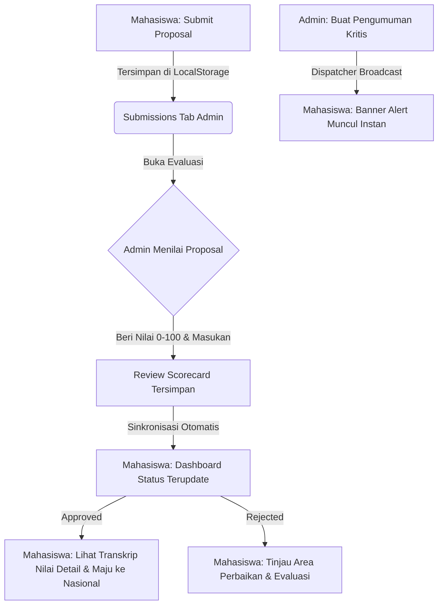

# 🏆 Telkom-In-Competition

[](https://react.dev/)
[](https://vite.dev/)
[](https://tailwindcss.com/)
[](https://nodejs.org/)
[](https://supabase.com/)
[](https://zod.dev/)

**Telkom-In-Competition** adalah platform digital berbasis kampus yang dirancang khusus untuk menyederhanakan, mengelola, serta melacak keikutsertaan mahasiswa dalam berbagai ajang kompetisi ilmiah dan inovasi (nasional maupun internasional). Platform ini mengintegrasikan seluruh alur evaluasi internal universitas hingga transisi pendaftaran ke tahap nasional secara persisten, ramah tema (*dark/light mode*), dan terstruktur.

---

## 🔄 Alur Integrasi Mahasiswa & Admin

Berikut adalah diagram alur kerja interaktif yang menggambarkan bagaimana data tersinkronisasi secara *real-time* di seluruh platform:



---

## 📁 Struktur Repositori

Platform ini dibangun dengan pemisahan direktori utama untuk mempermudah pemeliharaan kode:

```bash
Telkom-In-Competition/
├── frontend/             # Aplikasi Client (Single Page Application)
│   ├── src/
│   │   ├── app/
│   │   │   ├── components/  # Navigasi, Kartu Kompetisi, Layout
│   │   │   ├── context/     # AuthContext & ThemeContext (Tema Sistem)
│   │   │   ├── data/        # Skema Sinkronisasi Lokal & competitions.ts
│   │   │   ├── pages/       # Dashboard User, Dashboard Admin, Scorecards
│   │   │   └── routes.tsx   # Konfigurasi Route React Router v7
│   │   └── main.tsx         # Root Mounting Point
│   ├── package.json
│   └── vite.config.ts
│
└── backend/              # Server REST API
    ├── src/
    │   ├── controllers/     # Logika Kontroler (Auth, Kompetisi, Registrasi)
    │   ├── docs/            # Konfigurasi & Endpoint API-Docs Swagger
    │   ├── middleware/      # Keamanan API (Auth token, Rule Admin)
    │   ├── routes/          # API Route Endpoint (Express)
    │   ├── utils/           # Winston Logger, DB Helper
    │   └── server.js        # Bootstrapping Express Server
    ├── package.json
    └── readme.md
```

---

## ✨ Fitur Utama Platform

### 👨‍🎓 Sisi Mahasiswa (Student Dashboard)
*   **Announcement Megaphone Banner**: Penayangan pesan pengumuman darurat, perubahan jadwal, atau info sistem yang diterbitkan admin secara dinamis di bagian paling atas layar.
*   **Progress Dashboard Tracking**: Visualisasi kemajuan kompetisi aktif (*University Review*, *Approved*, *National Stage*, *Reviewed*) lengkap dengan bilah kemajuan berwarna.
*   **Interactive Review Scorecard**: Mahasiswa dapat melihat detail nilai kualitatif per-kriteria kelulusan (Inovasi, Kelayakan, Tim, dll.) yang disajikan dengan diagram progres visual, daftar kelebihan proposal, area pembenahan, serta catatan kaki dari reviewer kampus.
*   **Akses Registrasi Cepat**: Akses langsung ke pendaftaran tingkat nasional begitu proposal universitas dinyatakan lolos.

### 👩‍💼 Sisi Administrator (Admin Workspace)
*   **Interactive Analytics (Recharts)**: Grafik visual dinamis yang memetakan tren pendaftaran bulanan dan proposal masuk yang ramah tema (*dark/light*).
*   **Live Curation Badges**: Tombol curating **Featured** dan **Recommended** pada tabel kompetisi untuk mengontrol penayangan slider halaman depan secara *real-time*.
*   **Visual Poster Picker & Previews**: Box formulir kompetisi modern yang dilengkapi picker poster kategori Telkom University serta preview banner seketika sebelum disimpan.
*   **Evaluation Scoreboard Form**: Papan input penilaian range slider (0-100) interaktif, strengths list, improvements list, dan ulasan penilai yang terhubung secara instan.
*   **Excel/CSV Exporter**: Mengekspor database partisipan aktif kampus ke berkas spreadsheet `.csv` langsung dari browser dalam hitungan milidetik.
*   **Dispatcher Mega Alerts**: Pembuatan alert broadcast global dengan pilihan tingkatan urgensi (`Info`, `Warning`, `Critical`).

---

## 🎨 Unified Theme & Aesthetics (Dark / Light Mode)

Platform ini mengusung estetika desain premium modern:
*   **HSL Palette**: Menggunakan skema warna HSL yang disesuaikan secara konsisten (merah khas Telkom University `#C8102E`, abu-abu gelap `#0B0F19`, `#0F172A`, dan putih bersih).
*   **Micro-Animations**: Transisi hover pada tombol, animasi pemuatan, dan pergeseran menu yang halus memanfaatkan `motion/react`.
*   **Theme Switcher**: Penyesuaian tema penjelajah yang mulus di seluruh tab panel admin, grafik statistik, form input, dan detail transkrip scorecard mahasiswa.

---

## 💻 Panduan Instalasi Lokal

### 🎨 1. Menjalankan Frontend (`/frontend`)

1. Pindah ke direktori frontend:
   ```bash
   cd frontend
   ```
2. Pasang modul dependensi:
   ```bash
   npm install
   ```
3. Jalankan server lokal mode pengembangan:
   ```bash
   npm run dev
   ```
   Aplikasi client akan aktif di `http://localhost:5173` (atau port alternatif berikutnya seperti `5174`).

4. Build produksi siap deploy:
   ```bash
   npm run build
   ```

---

### ⚙️ 2. Menjalankan Backend (`/backend`)

1. Pindah ke direktori backend:
   ```bash
   cd backend
   ```
2. Pasang dependensi API:
   ```bash
   npm install
   ```
3. Buat berkas konfigurasi lingkungan dari template:
   ```bash
   cp .env.example .env
   ```
   Isi konfigurasi variabel pada berkas `.env` dengan data Supabase Anda:
   ```env
   PORT=5000
   SUPABASE_URL=your_supabase_url
   SUPABASE_ANON_KEY=your_supabase_anon_key
   JWT_SECRET=your_jwt_secret_token
   ```
4. Jalankan server API backend:
   ```bash
   npm run dev
   ```
   Server API backend akan aktif di `http://localhost:5000`. Dokumen API Swagger yang interaktif dapat Anda akses langsung di `http://localhost:5000/api-docs`.

---

## 📝 Aturan Commit Kode (Conventional Commits)

Untuk menjaga kebersihan repositori dan riwayat pengembangan yang profesional, kami menerapkan standar commit berikut:

*   `feat(...)`: Fitur baru untuk pengguna (misal: `feat(admin-sync): add visual poster picker`)
*   `fix(...)`: Perbaikan bug (misal: `fix(auth): correct token refresh expiration`)
*   `docs(...)`: Pembaruan dokumentasi (misal: `docs(readme): expand setup instructions`)
*   `style(...)`: Perubahan gaya penulisan kode tanpa merubah fungsi (misal: linting, beautify)
*   `refactor(...)`: Restrukturisasi kode internal (misal: `refactor(charts): optimize recharts dynamic rendering`)
